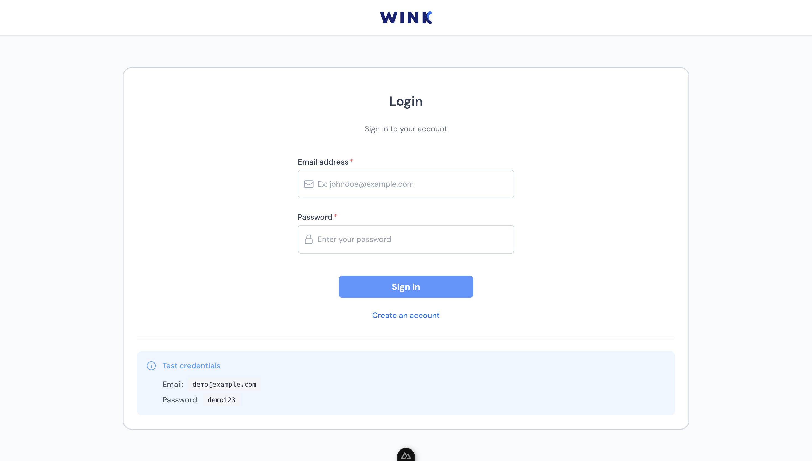

# WINK - Technical Test



## 🎯 But du projet

WINK est une application web moderne de gestion d'inscription et d'authentification d'entreprises. Le projet implémente un processus d'inscription multi-étapes permettant aux utilisateurs de :

1. **Saisir leurs informations personnelles** (prénom, nom, email, photo de profil)
2. **Créer leur espace de travail** (nom de l'entreprise, logo, adresse)
3. **Compléter les informations sur l'entreprise** (description, secteur d'activité, taille)

Une fois l'inscription terminée, l'utilisateur peut se connecter avec ses identifiants pour accéder à l'application.

### Fonctionnalités principales

- ✅ **Authentification** : Système de connexion sécurisé avec gestion de session
- ✅ **Inscription multi-étapes** : Processus guidé en 3 étapes avec sauvegarde automatique
- ✅ **Gestion d'entreprise** : Création et gestion de profils d'entreprise
- ✅ **Upload de fichiers** : Upload de photos de profil et logos d'entreprise
- ✅ **Internationalisation** : Support français et anglais
- ✅ **Validation de formulaire** : Validation côté client avec Valibot
- ✅ **Mock API** : Utilisation de MSW pour simuler les appels API

## 🏗️ Architecture

Ce projet implémente une **Clean Architecture** adaptée à Nuxt 3, garantissant une séparation claire des responsabilités et une maintenabilité optimale.

### Structure du projet

```
wink-technical-test/
├── adapters/                    # Adapters pour intégrations externes
│   ├── api/
│   │   ├── ApiAdapter.ts       # Implémentation concrète de l'API
│   │   └── types.ts            # Interface IApiAdapter
│   └── __mocks__/
│       └── ApiAdapter.mock.ts  # Mock pour tests
│
├── repositories/                # Repositories pour logique métier
│   └── company/
│       ├── CompanyRepository.ts # Logique métier Company
│       └── types.ts            # Types du repository
│
├── composables/                # ViewModels (logique de présentation)
│   ├── auth/
│   │   ├── useAuth.ts         # Gestion de l'authentification
│   │   └── useLoginForm.ts    # Formulaire de connexion
│   ├── company/
│   │   └── useCompanyRegistration.ts
│   ├── registration/
│   │   ├── useAboutYouForm.ts
│   │   ├── usePersonalDetailsForm.ts
│   │   ├── useRegistrationState.ts
│   │   └── useWorkspaceForm.ts
│   └── repositories/
│       └── useCompanyRepository.ts
│
├── components/                 # Composants Vue (UI pure)
│   ├── company/
│   │   ├── CompanyRegistrationForm.vue
│   │   └── CompanyLogoUpload.vue
│   ├── profile/
│   │   └── ProfileUploader.vue
│   └── ui/
│       ├── LanguageSwitcher.vue
│       └── ProfileSelector.vue
│
├── pages/                      # Pages Nuxt (routing)
│   ├── index.vue              # Page d'accueil
│   ├── login.vue              # Page de connexion
│   └── welcome/
│       ├── personal-details.vue  # Étape 1
│       ├── workspace.vue         # Étape 2
│       └── about-you.vue         # Étape 3
│
├── plugins/                    # Injection de dépendances
│   ├── adapters.provider.ts   # Provide les adapters
│   └── msw.client.ts          # Configuration MSW
│
├── mocks/                      # Handlers MSW
│   └── handlers/
│       ├── auth.ts            # Mock endpoints d'authentification
│       ├── companies.ts       # Mock endpoints entreprises
│       └── index.ts
│
├── middleware/                 # Middleware Nuxt
│   └── auth.ts                # Protection des routes
│
├── layouts/                    # Layouts Nuxt
│   └── auth.vue               # Layout pour pages d'authentification
│
├── i18n/                       # Fichiers de traduction
│   └── locales/
│       ├── fr.json
│       └── en.json
│
└── types/                      # Types TypeScript globaux
    ├── company.ts
    └── nuxt.d.ts
```

### Principes architecturaux

#### 1. Séparation des préoccupations

- **View (Component)** : UI uniquement, pas de logique métier
- **ViewModel (Composable)** : État et logique de présentation
- **Repository** : Logique métier pure
- **Adapter** : Intégrations externes (API, services)

#### 2. Dependency Inversion

- Les composants dépendent des composables
- Les composables dépendent des repositories
- Les repositories dépendent des adapters (via interfaces)
- Injection de dépendances via `nuxtApp.provide()` et `inject()`

#### 3. Type Safety

- Interfaces TypeScript partout
- Pas de `any`
- Types stricts avec validation runtime (Valibot)

### Flux de données

```
Component (Vue)
    ↓ utilise
Composable (ViewModel)
    ↓ utilise
Repository (Logique métier)
    ↓ utilise
Adapter (Interface)
    ↓ implémente
ApiAdapter (Concret)
    ↓ appelle
API (MSW mockée)
```

## 🚀 Technologies utilisées

- **Framework** : [Nuxt 3](https://nuxt.com/) - Framework Vue.js full-stack
- **UI** : [Nuxt UI](https://ui3.nuxt.com/) - Composants UI basés sur Tailwind CSS
- **Validation** : [Valibot](https://valibot.dev/) - Validation de schémas légère et performante
- **Internationalisation** : [@nuxtjs/i18n](https://i18n.nuxtjs.org/) - Support multilingue
- **Mocking** : [MSW](https://mswjs.io/) - Mock Service Worker pour les APIs
- **TypeScript** : Typage statique pour une meilleure maintenabilité
- **Tailwind CSS** : Framework CSS utilitaire

## 📦 Installation

### Prérequis

- Node.js 18+ 
- pnpm (recommandé) ou npm/yarn/bun

### Étapes d'installation

1. **Cloner le projet** (si applicable)
   ```bash
   git clone <repository-url>
   cd wink-technical-test
   ```

2. **Installer les dépendances**
   ```bash
   # Avec pnpm (recommandé)
   pnpm install

   # Ou avec npm
   npm install

   # Ou avec yarn
   yarn install

   # Ou avec bun
   bun install
   ```

## 🏃 Lancer le projet

### Mode développement

Démarrer le serveur de développement sur `http://localhost:3000` :

```bash
# Avec pnpm
pnpm dev

# Avec npm
npm run dev

# Avec yarn
yarn dev

# Avec bun
bun run dev
```

Le serveur de développement démarre automatiquement avec :
- ✅ Hot Module Replacement (HMR)
- ✅ MSW activé pour mocker les APIs
- ✅ Support TypeScript
- ✅ Internationalisation (FR/EN)

### Mode production

1. **Construire l'application**
   ```bash
   pnpm build
   ```

2. **Prévisualiser la build de production**
   ```bash
   pnpm preview
   ```

## 🧪 Tests

L'architecture est conçue pour être facilement testable :

- **Adapters** : Mockables via `MockApiAdapter`
- **Repositories** : Testables sans DOM, logique métier pure
- **Composables** : Testables avec mocks des repositories
- **Components** : Testables avec mocks des composables

```bash
# Lancer les tests
pnpm test
```

## 📝 Utilisation

### Processus d'inscription

1. **Page de connexion** (`/login`)
   - Connexion avec email/mot de passe
   - Lien vers l'inscription

2. **Étape 1 - Informations personnelles** (`/welcome/personal-details`)
   - Prénom, nom, email
   - Photo de profil (optionnel)
   - Sauvegarde automatique dans le localStorage

3. **Étape 2 - Espace de travail** (`/welcome/workspace`)
   - Nom de l'entreprise
   - Logo de l'entreprise
   - Adresse du siège social
   - Sauvegarde automatique

4. **Étape 3 - À propos** (`/welcome/about-you`)
   - Description de l'entreprise
   - Secteur d'activité
   - Taille de l'entreprise
   - Création du compte final

### Identifiants de test

Les identifiants de test sont affichés sur la page de connexion :
- **Email** : `demo@example.com`
- **Password** : `demo123`

## 🔧 Configuration

### Variables d'environnement

Le projet utilise MSW pour mocker les APIs, aucune configuration supplémentaire n'est nécessaire pour le développement.

### Internationalisation

Les langues supportées sont configurées dans `nuxt.config.ts` :
- Français (par défaut)
- Anglais

Le changement de langue se fait automatiquement selon les préférences du navigateur ou via le composant `LanguageSwitcher`.

## 📚 Documentation supplémentaire

Pour plus de détails sur l'architecture, consultez le fichier [ARCHITECTURE.md](./ARCHITECTURE.md).

## ⏱️ Temps de développement

Ce projet a été développé en **11 à 12 heures** de travail, incluant :
- La mise en place de l'architecture Clean Architecture
- L'intégration de tous les composants et fonctionnalités
- La configuration de MSW pour le mocking des APIs
- L'implémentation de l'internationalisation (FR/EN)
- La création du processus d'inscription multi-étapes
- La gestion de l'authentification et des sessions

## 🤝 Contribution

Ce projet est un test technique. Pour toute question ou suggestion, n'hésitez pas à ouvrir une issue.

## 📄 Licence

Ce projet est un test technique et n'est pas destiné à la production.
